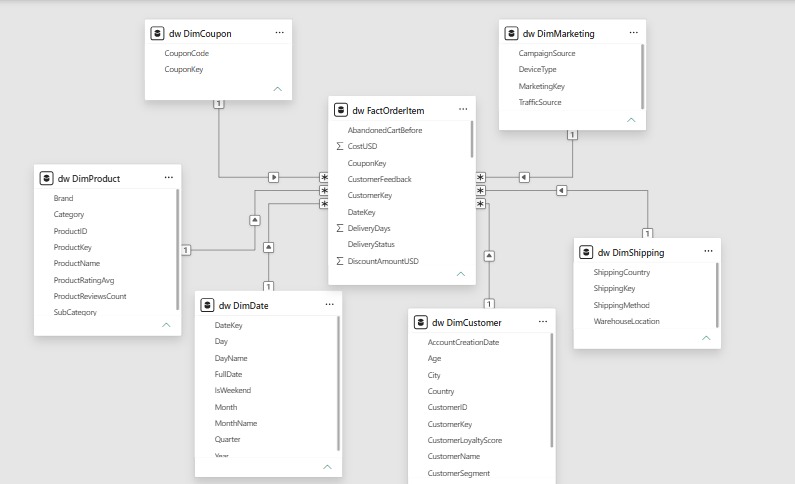
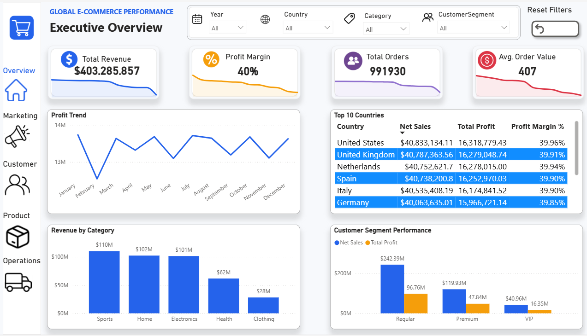
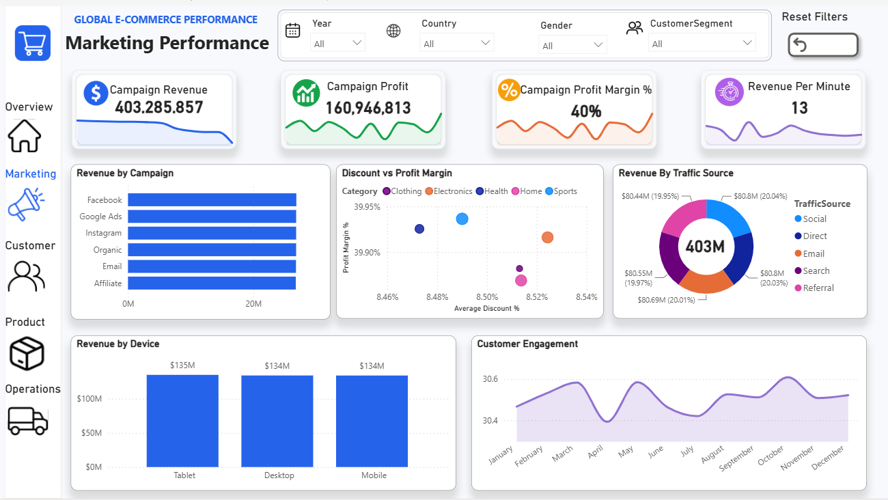
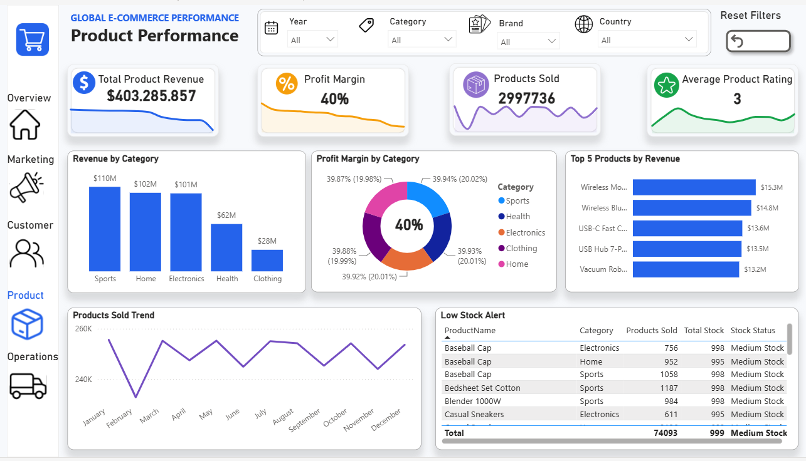
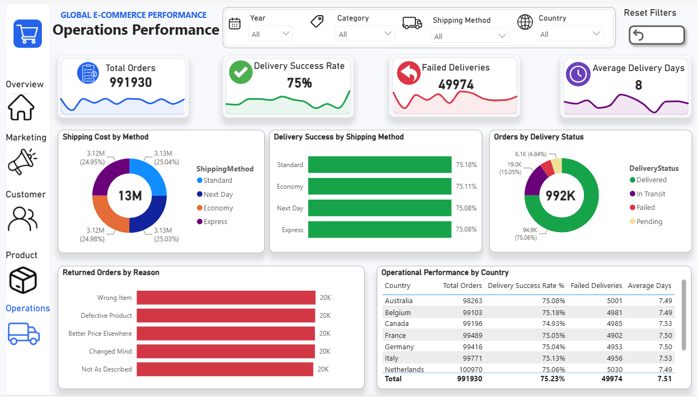

# Global E-Commerce Sales & Marketing Analytics Dashboard

## Project Overview

An end-to-end Business Intelligence project that transforms global e-commerce transactional data into actionable insights across sales, marketing, customers, products, and operations.

**Workflow:** Raw Data → Data Understanding & Cleaning → Dimensional Modeling → SQL Server → Power BI → Business Insights

## Initial Data Structure

The project initially started with the entire dataset stored in **one large transactional table** containing **1,000,123 rows and 62 columns**. It combined customer, product, sales, marketing, payment, shipping, customer experience, engagement, and risk information.

The single-table structure was appropriate for exploration but was not ideal for scalable analytical reporting. It contained repeated descriptive attributes and mixed multiple business subjects in one structure.

## Data Understanding & Cleaning

Initial exploration was performed with Python/Pandas in Google Colab.

Key findings:

* 1,000,123 rows × 62 columns
* 0 completely duplicated rows
* 991,930 unique Order IDs
* 8,193 repeated Order IDs
* 0 duplicate `OrderID + ProductID` combinations
* `return_reason`: 90.01% missing
* `coupon_code`: 50.00% missing
* `customer_feedback`: 19.96% missing
* Currency: USD only

Repeated Order IDs were retained because the dataset is at **order-item level**. The `OrderID + ProductID` combination was unique.

Detailed findings: `reports/README.md`
Exploration notebook: `notebooks/data_understanding_and_cleaning.ipynb`

## Dimensional Data Model

The original single transactional table was transformed into a **Star Schema** in SQL Server.



### Dimensions

* **DimCustomer:** customer identity, demographics, segment, location, loyalty, account information
* **DimProduct:** product, category, sub-category, brand, ratings and reviews
* **DimMarketing:** campaign, traffic source and device
* **DimCoupon:** coupon code
* **DimShipping:** shipping method, country and warehouse
* **DimDate:** calendar attributes for time intelligence

### FactOrderItem

Contains transaction-level foreign keys and measures including order status, return reason, quantity, prices, discounts, revenue, cost, profit, tax, inventory, shipping, payment, ratings, engagement, fraud risk, priority and support information.

The SQL Server warehouse uses the `dw` schema and primary/foreign-key relationships.

## SQL Server

SQL Server was used for the analytical data warehouse and loading process.

* `SQL/create_schema.sql` — creates the dimensional model
* `SQL/loading_data.sql` — loads dimensions and fact data from the original `ecommerce_dataset`

SQL was intentionally used for the **data modeling and loading layer**, while Power BI is used for visualization and business analysis.

## Power BI Dashboard

### 1. Executive Overview

Provides management with a high-level view of revenue, profit, margin, orders, customers, trends, geographic performance and customer segments.



### 2. Marketing Performance

Analyzes campaign, traffic-source and device performance, coupon usage and digital engagement.



### 3. Product Performance

Analyzes product/category/brand revenue and profit, ratings, sales volume and inventory, including low-stock alerts.



### 4. Operations

Monitors delivery, shipping, returns and fulfillment performance.



## Main DAX Analytics

**Sales:** Total Revenue, Total Profit, Profit Margin %, Gross Sales, Net Sales, Total Cost, Total Discount, Total Tax, Total Shipping Cost, Total Quantity, Total Orders, Total Order Items, Average Order Value, Average Order Profit, Average Discount %

**Orders:** Completed, Cancelled, Pending, Processing and Returned Orders; Completion, Cancellation, Pending and Return Rates

**Customers:** Total/VIP/Premium/Regular Customers, Average Age, Loyalty Score and Rating, Positive/Neutral/Negative Reviews, Positive Review %

**Digital Engagement:** Abandoned Cart Orders/Rate, Average Session Duration, Average Pages Visited

**Marketing:** Campaign Revenue, Campaign Profit, Campaign Profit Margin %, Revenue Per Minute

**Products:** Product Revenue, Product Profit, Products Sold, Average Product Rating

**Risk:** Average Fraud Risk, High-Risk Orders, High-Risk Rate %

**Operations:** Average Delivery Days, Delivered Orders, Delivery Success Rate %, Failed Deliveries

**Time Intelligence:** Previous Year Revenue/Profit, Revenue/Profit YTD, Revenue YOY %, Profit YOY %

## UX & Interactivity

The report uses interactive filters and business-focused navigation, including:

* Date, country, category, campaign, customer segment and product slicers
* KPI cards with year-over-year indicators
* Tooltips
* Page navigation and buttons
* Drill-down analysis
* Conditional formatting
* Low-stock alerts

The design emphasizes visual hierarchy, minimal clutter, consistent KPI definitions and usability for non-technical business users.

## Business Value

The solution helps management:

* Monitor overall performance from one source of truth
* Identify revenue and profit drivers
* Evaluate marketing effectiveness
* Understand customer behavior and segments
* Compare product and category performance
* Monitor inventory and low-stock products
* Evaluate delivery and return performance
* Monitor fraud-risk indicators
* Reduce reliance on manual spreadsheet reporting


## Technology Stack

| Layer            | Technology        |
| ---------------- | ----------------- |
| Exploration      | Python / Pandas   |
| Data Preparation | Python / Pandas   |
| Data Modeling    | SQL Server        |
| Data Warehouse   | SQL Server        |
| Analytical Model | Star Schema       |
| Visualization    | Power BI          |
| Analytics        | DAX               |
| Documentation    | Markdown / GitHub |

## End-to-End Workflow

```text
RAW E-COMMERCE DATA
        ↓
DATA UNDERSTANDING & QUALITY CHECK
        ↓
CLEANING & PREPARATION
        ↓
DIMENSIONAL MODELING
        ↓
SQL SERVER DATA WAREHOUSE
        ↓
DATA LOADING
        ↓
POWER BI
        ↓
DAX MEASURES & KPIs
        ↓
INTERACTIVE DASHBOARDS
        ↓
BUSINESS INSIGHTS & DECISION SUPPORT
```

